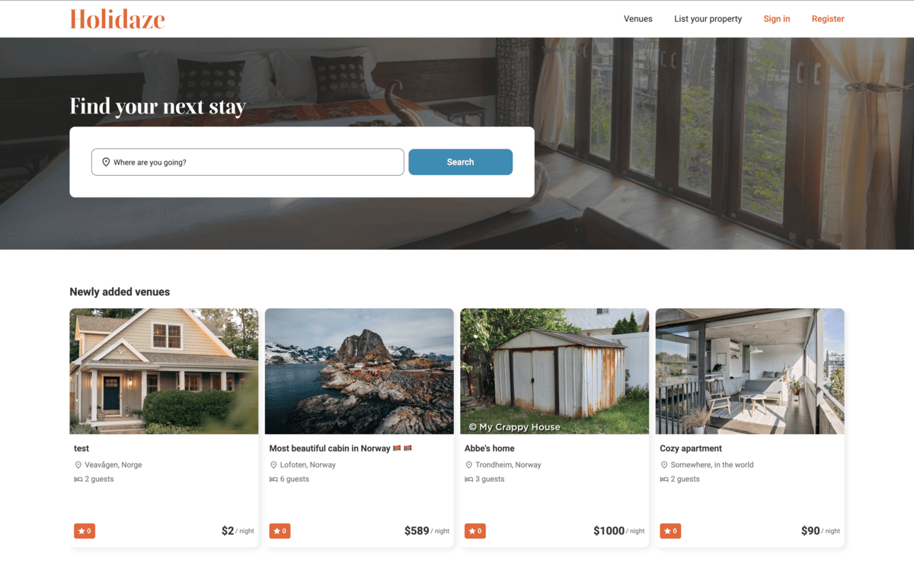
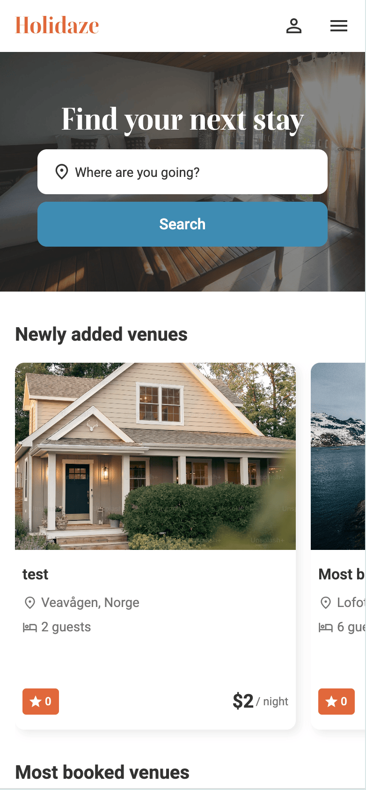
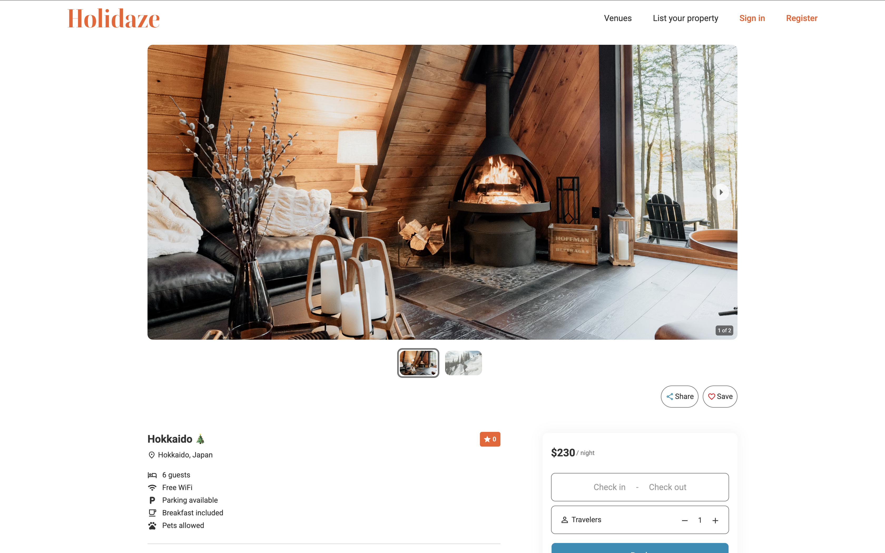
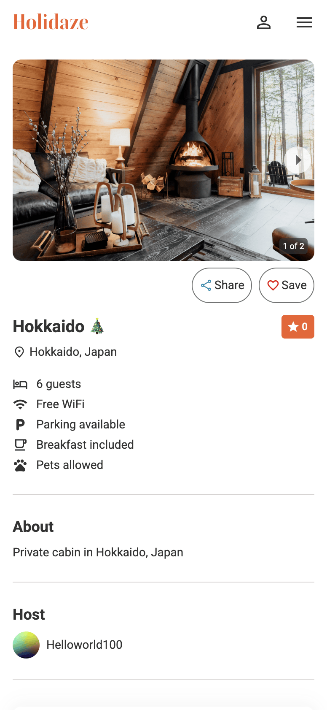
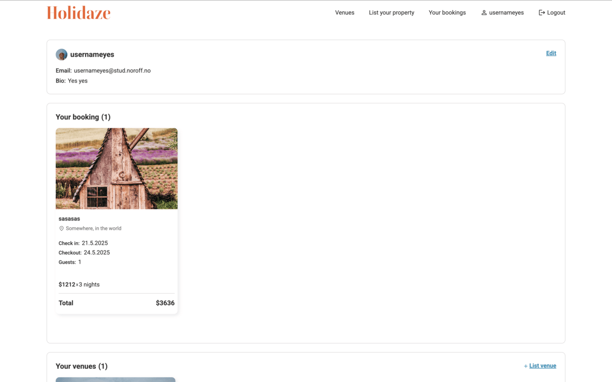
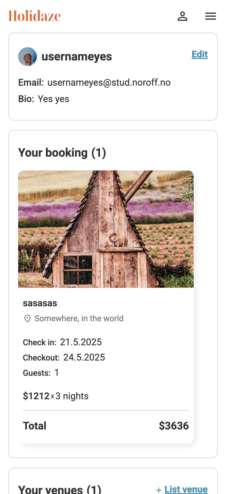

# Holidaze

## Overview

Holidaze is a booking platform for holiday venues, built with React and styled using Tailwind CSS. Users can search for venues, view details, and book accommodations. Admin users (Venue Managers) can create and manage their own listings.

## Live Demo

[Deployed Application](https://reactecom-project.netlify.app/)

## Technologies Used

- React
- React Router
- Tailwind CSS
- REST API
- ReactIcons / Material UI Icons
- SessionStorage (for token/session persistence)

## Features

- **Responsive Design**: Optimized for both desktop and mobile users.
- **Venue Search**: Filter venues by keywords and see results instantly.
- **Venue Details Page**: View venue description, location, amenities, images, rating, and price.
- **Booking System**: Users can book a venue with check-in and check-out dates.
- **User Authentication**: Login/sign-up with role-based behavior.
- **Profile Page**: Users can view and cancel their bookings. Users also can create, edit, and delete venues.

## Highlights / Unique Implementations

- **Date Picker Integration**: For selecting booking dates with validation.
- **Dynamic Routing**: Pages generated for each venue using react-router-dom.
- **Role-based Views**: Conditional UI rendering based on user role.
- **Custom Icons & Styling**: Designed with attention to UI/UX using Tailwind CSS.

## Installation & Setup

1. Clone the repository:
   ```sh
   git clone https://github.com/H-chai/Holidaze.git
   ```
2. Navigate to the project folder:
   ```sh
   cd holidaze
   ```
3. Install dependencies:
   ```sh
   npm install
   ```
4. Start the development server:
   ```sh
   npm run start
   ```
5. Open [http://localhost:3000](http://localhost:3000) in your browser.

## API

This project uses the [Noroff API](https://v2.api.noroff.dev/holidaze) to fetch product data.

- Retrieve all venues:
  ```sh
  GET https://v2.api.noroff.dev/holidaze/venues
  ```
- Retrieve a single venue by ID:
  ```sh
  GET https://v2.api.noroff.dev/holidaze/{id}
  ```
- Create booking:
  ```sh
  POST https://v2.api.noroff.dev/holidaze/bookings
  ```

## Project Structure

```
/src
  ├── components
  │   ├── Header
  │   │   ├── AuthorizedDesktopHeader.jsx
  │   │   ├── AuthorizedMobileHeader.jsx
  │   │   ├── Header.jsx
  │   │   ├── HeaderRight.jsx
  │   │   ├── UnauthorizedDesktopHeader.jsx
  │   │   └── UnauthorizedMobileHeader.jsx
  │   ├── homePage
  │   │   ├── CallToActionSection.jsx
  │   │   ├── HeroSection.jsx
  │   │   ├── MostPopularSection.jsx
  │   │   ├── NewlyAddedSection.jsx
  │   │   ├── SearchResultSection.jsx
  │   │   └── TrendingDestinationSection.jsx
  │   ├── BackToTop.jsx
  │   ├── Footer.jsx
  │   ├── Layout.jsx
  │   └── SearchForm.jsx
  ├── hooks
  │   ├── useApi.jsx
  │   └── useLogout.jsx
  ├── pages
  │   ├── AllVenues.jsx
  │   ├── BookingDon.jsx
  │   ├── EditBooking.jsx
  │   ├── EditProfile.jsx
  │   ├── Home.jsx
  │   ├── ListVenue.jsx
  │   ├── Login.jsx
  │   ├── Profile.jsx
  │   ├── Register.jsx
  │   ├── TrendingDestination.jsx
  │   └── Venue.jsx
  ├── routes
  │   ├── AppRoutes.jsx
  │   └── ScrollToTop.jsx
  ├── utils
  │   ├── clearInput.js
  │   ├── dateUtils.jsx
  │   └── handleVenueSearch.js
  ├── App.css
  ├── App.jsx
  ├── index.css
  └── main.jsx
```

## Future Improvements

- Improve UI/UX design (Dark mode, better accessibility)

## Screenshots

### Homepage

#### Desktop



#### Mobile



### Venue Page

#### Desktop



#### Mobile



### Profile page

#### Desktop



#### Mobile


